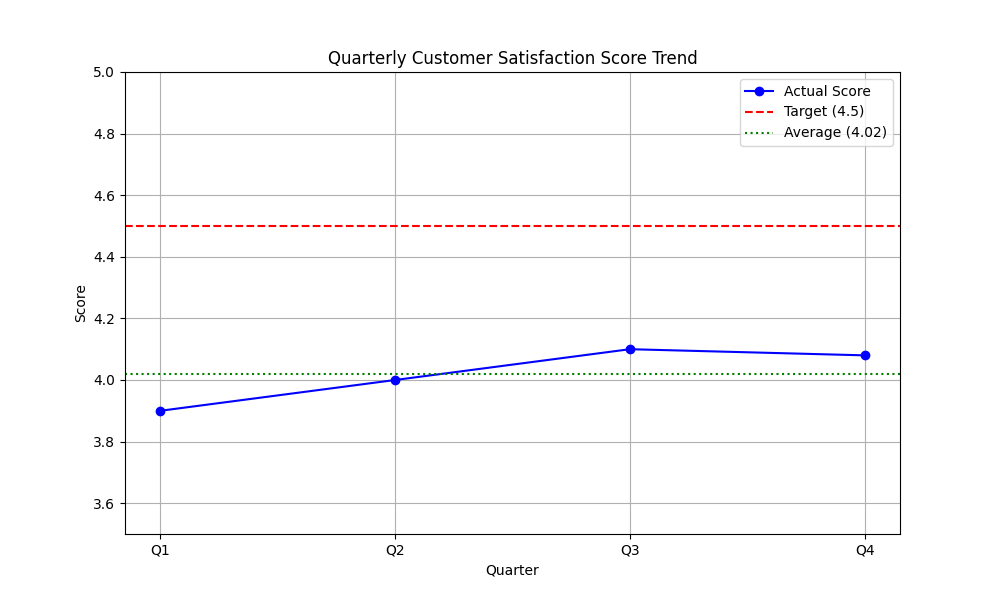

# Quarterly Performance Analysis

## Contact
Email: 24f3001410@ds.study.iitm.ac.in

## Data Story

### Key Findings
Our analysis of the quarterly data reveals that the average customer satisfaction score for the year is **4.02**. The trend shows a slight fluctuation, with scores ranging from 3.9 in Q1 to a peak of 4.1 in Q3, ending the year at 4.08. Despite the upward trend in the middle of the year, we are consistently falling short of our target.

### Business Implications
The current average of 4.02 is significantly below our strategic target of **4.5**. This gap suggests that while customers are generally satisfied, there is room for significant improvement. Failing to reach the 4.5 benchmark could lead to:
*   Stagnation in customer loyalty.
*   Risk of churn to competitors with superior service.
*   Missed opportunities for organic growth through referrals.

### Recommendations
To bridge the gap between our current performance (4.02) and the target (4.5), we recommend the following solution:
**Improve service quality and wait times.**

Specific actions include:
1.  **Staff Training:** Enhance service quality through targeted training programs focusing on empathy and efficiency.
2.  **Process Optimization:** Streamline operations to reduce wait times, a key driver of customer dissatisfaction.
3.  **Feedback Loop:** Implement a more robust real-time feedback mechanism to address issues immediately.

## Visualizations

